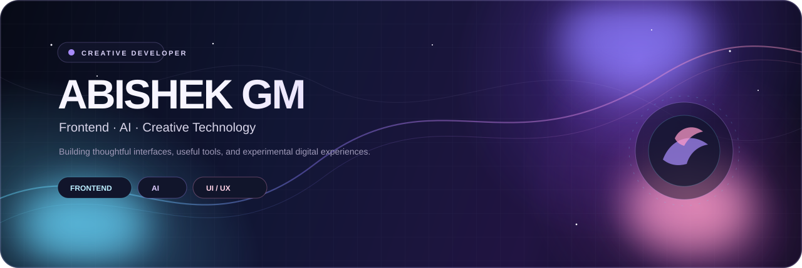

<div align="center">



<br/>

[](https://github.com/G-Abishek-M)
[](https://github.com/G-Abishek-M?tab=repositories)

</div>


## ✦ A little about me

I'm **Abishek GM**, a developer interested in the space where **frontend development, AI, and visual creativity** overlap.

I like taking an idea from a rough concept to a working interface — experimenting with layouts, interactions, responsive design, and practical tools along the way.

```text
01  BUILD       →       02  EXPERIMENT       →       03  REFINE
     ideas              new technology              better experiences
```

---

## ◇ What I work with

<div align="center">


</div>

---

## ✧ Selected work

### 01 — Zoros Dashboard
A frontend dashboard project focused on structured information, interface layout, and responsive presentation.

**Stack / focus:** `Frontend` `UI` `Dashboard`

→ **[Open repository](https://github.com/G-Abishek-M/Zoros-dashboard)**

### 02 — Netflix Dashboard
A Netflix-inspired dashboard interface exploring content presentation, navigation, and responsive frontend design.

**Stack / focus:** `Frontend` `UI` `Responsive Design`

→ **[Open repository](https://github.com/G-Abishek-M/Netflix-dashboard)**

### 03 — Lizard
A web project built around interactive frontend development and experimentation.

**Stack / focus:** `Web` `Frontend` `JavaScript`

→ **[Open repository](https://github.com/G-Abishek-M/Lizard)**

### 04 — Lizard Code Editor
A lightweight developer-tool project exploring the interface and workflow of a browser-based coding experience.

**Stack / focus:** `Editor` `Frontend` `Developer Tools`

→ **[Open repository](https://github.com/G-Abishek-M/Lizard-Code-Editor)**

<details>
<summary><b>More from my repositories</b></summary>

<br/>

**Abishek** — personal/project repository  
→ [Open repository](https://github.com/G-Abishek-M/Abishek)

**All repositories**  
→ [github.com/G-Abishek-M?tab=repositories](https://github.com/G-Abishek-M?tab=repositories)

</details>

---

## ◎ Currently exploring

<table>
<tr>
<td width="33%" align="center">

### AI
Personal assistants<br/>
AI-powered interfaces<br/>
Automation

</td>
<td width="33%" align="center">

### FRONTEND
React<br/>
Responsive UI<br/>
Interaction & motion

</td>
<td width="33%" align="center">

### CREATIVE TECH
Visual systems<br/>
Experiments<br/>
Developer tools

</td>
</tr>
</table>

---

## ⌁ GitHub snapshot

<div align="center">


</div>

<br/>

<div align="center">


</div>

---

## ♢ My developer philosophy

> **Good software should work well. Great software should also feel good to use.**

I care about the small things — spacing, hierarchy, interaction, responsiveness, and the feeling a user gets while moving through an interface.

---

<div align="center">


<br/>

**[GitHub Profile](https://github.com/G-Abishek-M) · [All Projects](https://github.com/G-Abishek-M?tab=repositories)**

</div>
